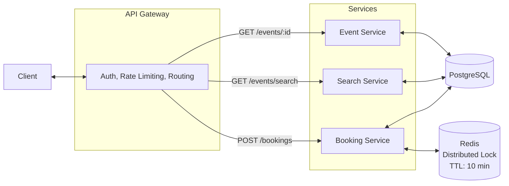

# Ticketmaster — Online Ticket Booking System

A system design implementation of an online ticket booking platform, inspired by Ticketmaster. Built to demonstrate handling of seat reservations, distributed locking, and concurrent booking scenarios.

For the full system design breakdown, see the [HLD notes](https://github.com/dev-ayush101/ReadmeForLife/blob/main/hld-problems/TicketMaster%20-%20Event%20Booking%20Platform.md).

## Tech Stack

- **Backend:** Spring Boot 3, Java 17
- **Frontend:** React 18, Vite, Tailwind CSS
- **Database:** PostgreSQL 15
- **Cache/Locking:** Redis 7
- **Migrations:** Flyway
- **Containerization:** Docker Compose

## Getting Started

### Prerequisites

- Java 17+
- Node.js 20+
- Docker & Docker Compose
- Maven

### Run

```bash
# start postgres and redis
docker-compose up -d

# start backend (terminal 1)
./mvnw spring-boot:run

# start frontend (terminal 2)
cd frontend
npm install
npm run dev
```

Backend runs on `http://localhost:8080`, frontend on `http://localhost:3000`

## Frontend

The React frontend has 3 pages:

- **Home** — search bar with event cards, click any card to view the event
- **Event** — event details with an interactive seat map (8×10 grid per event), select seats and reserve
- **Checkout** — 10-minute countdown timer mirroring the Redis lock TTL, mock payment form, confirm booking

### Seat Map Color Coding

| Color | Meaning |
|-------|---------|
| Green outline | Available — click to select |
| Green filled | Selected by you |
| Yellow | Reserved by another user |
| Gray | Sold |

### User Flow

1. Search or browse events on the home page
2. Click an event → see the seat map with real-time availability
3. Select one or more seats → sticky bottom bar shows total price
4. Click "Book Now" → seats are locked in Redis for 10 minutes
5. Fill payment details on the checkout page (mock)
6. Click "Pay" → booking confirmed, tickets marked as BOOKED
7. If you don't pay within 10 minutes, the reservation expires and seats are released

## API Endpoints

### Events

| Method | Endpoint | Description |
|--------|----------|-------------|
| GET | `/api/events/:eventId` | View event details with seat map and tickets |
| GET | `/api/events/search?keyword=&start=&end=&page=&size=` | Search events by keyword, date range |

### Bookings

| Method | Endpoint | Description |
|--------|----------|-------------|
| POST | `/api/bookings/:eventId` | Reserve tickets (locks seats for 10 min) |
| POST | `/api/bookings/:bookingId/confirm?userEmail=` | Confirm booking after payment |

#### Example: Search Events

```bash
GET /api/events/search?keyword=coldplay
```

```json
{
  "content": [
    {
      "id": "c2222222-...",
      "name": "Music of the Spheres",
      "description": "Coldplay world tour London show",
      "eventDate": "2024-01-20T20:00:00",
      "eventType": "CONCERT",
      "venue": { "name": "Wembley Stadium", "capacity": 80 },
      "performer": { "name": "Coldplay" }
    }
  ],
  "page": { "size": 10, "number": 0, "totalElements": 1, "totalPages": 1 }
}
```

#### Example: Reserve Tickets

```bash
POST /api/bookings/c2222222-2222-2222-2222-222222222222
Content-Type: application/json

{
  "ticketIds": ["d7717724-f01d-4dab-bd84-5c0fbe9a492a"],
  "userEmail": "ayush@test.com"
}
```

```json
{
  "id": "5cd9443e-...",
  "userEmail": "ayush@test.com",
  "totalPrice": 120.00,
  "status": "IN_PROGRESS",
  "tickets": [
    { "section": "A", "rowName": "4", "seatNumber": 9, "price": 120.00, "status": "AVAILABLE" }
  ]
}
```

#### Example: Confirm Booking

```bash
POST /api/bookings/5cd9443e-.../confirm?userEmail=ayush@test.com
```

```json
{
  "id": "5cd9443e-...",
  "status": "CONFIRMED",
  "tickets": [
    { "section": "A", "rowName": "4", "seatNumber": 9, "price": 120.00, "status": "BOOKED" }
  ]
}
```

#### Example: Error — Ticket Already Booked

```bash
POST /api/bookings/c2222222-.../
{ "ticketIds": ["d7717724-..."], "userEmail": "other@test.com" }
```

```json
{ "error": "Ticket d7717724-... is not available" }
```

## Architecture



### Booking Flow

1. User selects seats → `POST /bookings/:eventId` reserves tickets
2. Redis lock acquired per ticket (`SET ticket:lock:{id} NX EX 600`) — 10 min TTL
3. User completes payment → `POST /bookings/:bookingId/confirm` marks tickets as BOOKED
4. If user abandons checkout, Redis TTL expires and seats become available again

### Key Design Decisions

- **Redis distributed lock** over DB-level locks for ticket reservation — automatic TTL expiry, no cron jobs needed
- **Tiered pricing** — front rows cost more, back rows cheaper (seeded per event)
- **Native SQL queries** for search — cleaner than JPQL with nullable parameters
- **Shared database** across services — data is tightly coupled (bookings need tickets need events), ACID transactions required

## Data Model

- **Venue** — name, address, capacity, seat map (JSONB)
- **Performer** — name, description
- **Event** — links to venue + performer, date, type
- **Ticket** — per-seat record with section, row, seat number, price, status
- **Booking** — groups tickets under one purchase with user email and status

## Seed Data

Comes with 3 pre-loaded events:

| Event | Venue | Performer | Tickets |
|-------|-------|-----------|---------|
| Eras Tour NYC | Madison Square Garden | Taylor Swift | 80 seats |
| Music of the Spheres | Wembley Stadium | Coldplay | 80 seats |
| Arijit Live NYC | Madison Square Garden | Arijit Singh | 80 seats |